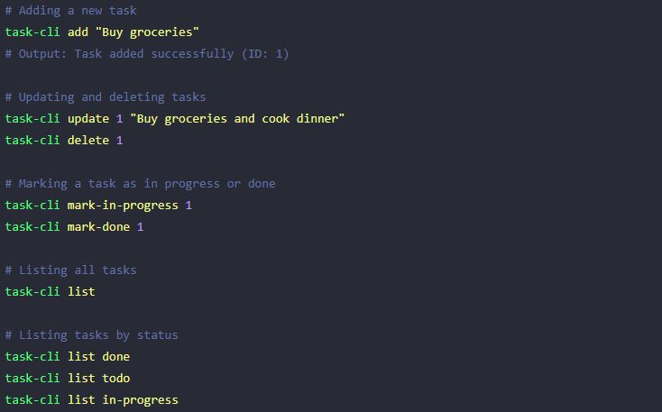

# Task Tracker

Build a CLI app to track your tasks and manage your to-do list.

### Requirements

The application should run from the command line, accept user actions and inputs as arguments, and store the tasks in a JSON file. The user should be able to:

- Add, Update, and Delete tasks
- Mark a task as in progress or done
- List all tasks
- List all tasks that are done
- List all tasks that are not done
- List all tasks that are in progress

Here are some constraints to guide the implementation:

- You can use any programming language to build this project.
- Use positional arguments in command line to accept user inputs.
- Use a JSON file to store the tasks in the current directory.
- The JSON file should be created if it does not exist.
- Use the native file system module of your programming language to interact with the JSON file.
- Do not use any external libraries or frameworks to build this project.
- Ensure to handle errors and edge cases gracefully.

### Example

The list of commands and their usage is given below:

### Task Properties

Each task should have the following properties:

- id: A unique identifier for the task
- description: A short description of the task
- status: The status of the task (todo, in-progress, done)
- createdAt: The date and time when the task was created
- updatedAt: The date and time when the task was last updated

Make sure to add these properties to the JSON file when adding a new task and update them when updating a task.

# roadmap.sh

Link: [Task Tracker CLI](https://roadmap.sh/projects/task-tracker)
Link: [Solution](https://roadmap.sh/projects/task-tracker/solutions?u=6479cefec4ec366ad5b78274)
